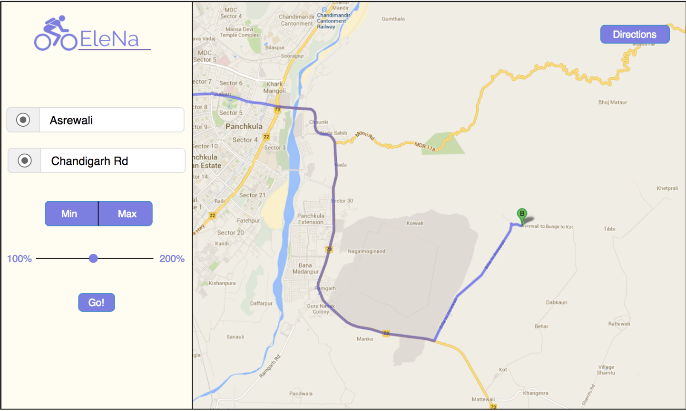

# EleNA: Elevation Based Navigation

### What is EleNA?
EleNa is an Elevation-based Navigation web application, we focused on with afocus on developing a complete system with an effective algorithm with a focuson the user-friendly interface. EleNa is used for finding an optimal biking/hikingroute  between  two  points,  where  the  user  would  want  to  either  maximize  orminimize the elevation gain, within some amount of distance that is a percentageof the shortest path.

## How to run

First install the both the frontend dependencies and server dependencies using the following two commands:

### `npm install`
### `pip install -r requirements.txt`

In the project directory, you can run the *react server* using the following command:

### `npm start`

Also in the the *src/server* folder, you can run the *python server* using the following command:

### `python server.py`
