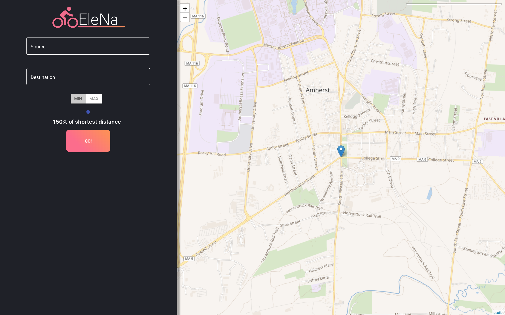

# EleNA: Elevation Based Navigation

## What is EleNA?
EleNa (Elevation-based Navigation) is a web application that finds the an optimal route between two points by taking not only distance, but also elevation gain into consideration. EleNa would be used by runners, bikers, and hikers alike in order to find routes that range from an easy stroll to an intense workout. In our implementation, we focused on developing a complete system, including a user-friendly UI and an effective algorithm. This is our final project for CS 520: Software Engineering.

## How to Run

First, install both the front-end dependencies and the server dependencies using the following two commands:

### `npm install`
### `pip install -r requirements.txt`

In the project's root directory, run the React client using the following command:

### `npm start`

In the the *src/server/* folder, run the Flask server using the following command:

### `python server.py`
